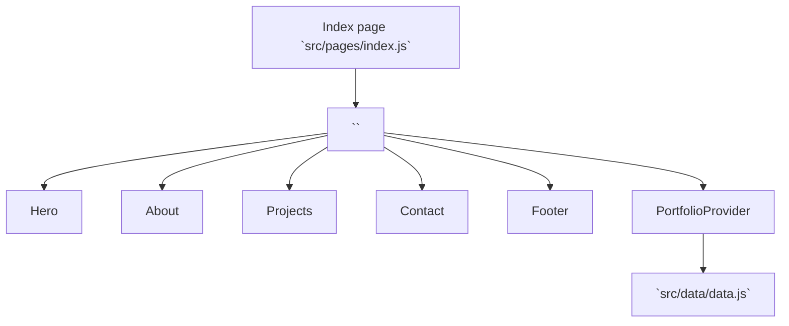
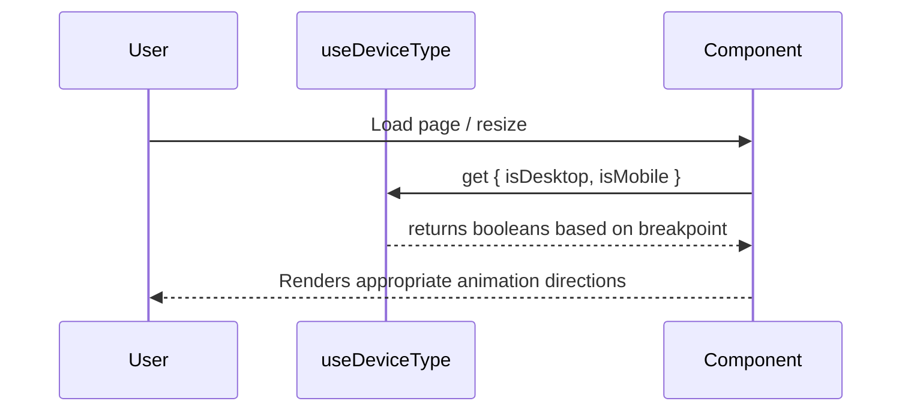

# Architecture Overview

This project is a Gatsby v5 React single-page portfolio that composes four main sections inside `App.jsx`, with data injected via a simple React Context from `src/data/data.js`.

- UI is styled with SCSS partials under `src/style/` and `react-bootstrap` layout components.
- Animations use custom wrappers in `src/transition/` and `react-tilt` for image effects.
- Images are loaded from `src/images/` and referenced by filename in the mock data.

## Data Flow
The `PortfolioProvider` context provides five slices:
- `hero`, `about`, `projects`, `contact`, `footer`

Components consume only the data they need via `useContext(PortfolioContext)` which keeps sections decoupled and modular.

## State and Responsiveness
A shared hook `src/hooks/useDeviceType.js` centralizes viewport detection to avoid repeated effect logic across components.

## Styling
SCSS is organized by concerns:
- `abstracts/` variables, mixins, helpers
- `base/` resets and typography
- `sections/` per-section styles (hero, about, projects, contact)
- `layout/` footer and layout helpers
- `components/` reusable button styles

Uses `sass-embedded` with modern API configuration to avoid deprecation warnings.

## Image Processing
Images are processed by Gatsby's GraphQL system:
- Images in `src/images/` are automatically discovered and processed
- GraphQL queries use case-insensitive filename matching (`/jpeg|jpg|png/i`)
- Images are matched using `endsWith()` for precise filename resolution
- Supports both development and production builds with proper path prefixing

## Build and Deployment
- Gatsby plugins handle images, manifest, sitemap, Sass, and remark.
- `npm run build` produces the static site under `public/`.
- `npm run deploy` publishes `public/` to GitHub Pages via `gh-pages`.

## Notable Changes in this pass
- Removed unused dependencies (MUI, Emotion, jQuery, axios, follow-redirects, webpack-dev-middleware) to reduce attack surface and bundle size.
- Upgraded Bootstrap to v5 to address advisories and modernize utilities.
- Centralized device detection with `useDeviceType` to improve maintainability.
- Migrated from `src/mock/` to `src/data/` for clearer data organization.
- Fixed image display issues with improved GraphQL queries and case-insensitive filename matching.
- Resolved Sass deprecation warnings by using `sass-embedded` with modern API configuration.
- Added comprehensive `.gitignore` for better repository hygiene.
- Implemented proper server startup sequences to prevent gray rectangle issues.
