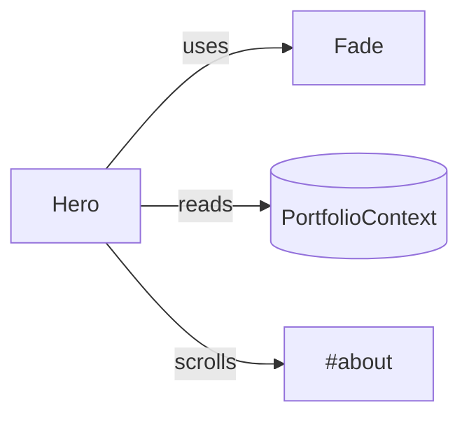
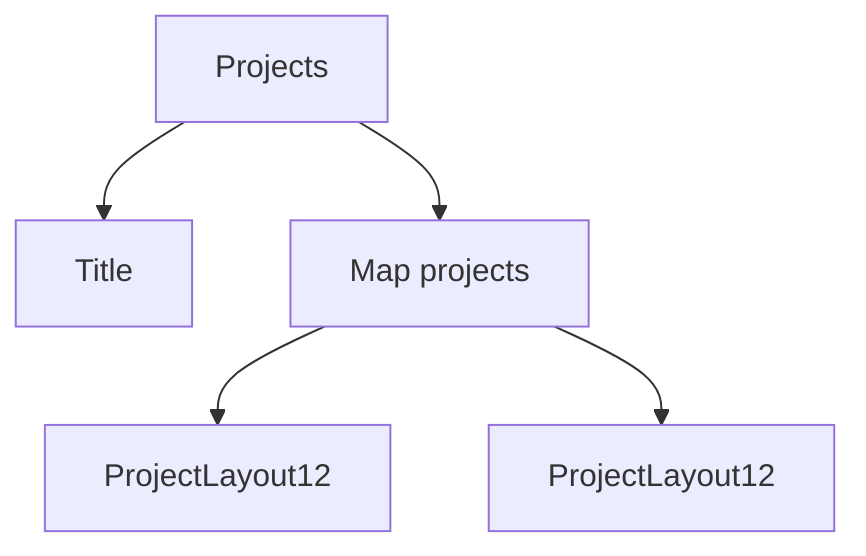

# UI Components

This document explains the key UI components and how they consume data from context.

## Hero (`src/components/Hero/Hero.jsx`)
- Reads: `hero.title`, `hero.name`, `hero.subtitle`, `hero.cta`
- Uses: `react-scroll` to scroll to `#about`
- Animations: `Fade` with direction based on `useDeviceType()`

## About (`src/components/About/About.jsx`)
- Reads: `about.img`, `about.paragraphOne`, `about.paragraphTwo`, `about.paragraphThree`
- Uses: `AboutImg` to resolve an image by filename
- Layout: `react-bootstrap` grid

## Projects (`src/components/Projects/Projects.jsx`)
- Reads: `projects[]` array of project cards
- Renders two images per project via `ProjectLayout12`
- Shows optional links to external URLs and repos

## ProjectLayout12 (`src/components/Image/ProjectLayout12.jsx`)
- Props: `filename`, `link`, `cap`, `enableimg`
- Conditional: if `enableimg` is true and `link` is provided, wraps image with anchor tag
- Animation: `Fade` and parallax tilt via `react-tilt`

## Contact (`src/components/Contact/Contact.jsx`)
- Reads: `contact.cta`, `contact.btn`, `contact.email`
- Creates mailto link when `email` exists

## Footer (`src/components/Footer/Footer.jsx`)
- Reads: `footer.title`, `footer.subtitle`, `footer.base`, `footer.networks[]`
- Renders FontAwesome brand icons for each network

## Title (`src/components/Title/Title.jsx`)
- Simple section heading renderer

## Images (`src/components/Image/*`)
- `AboutImg` and `ProjectImg` resolve images by filename from `src/images/`

## Transitions (`src/transition/*`)
- `Fade` and `RevealBase` provide animation primitives used across sections

## Data (`src/data/data.js`)
- Central place to update portfolio content without code changes
- IDs use `nanoid()` which is now at a non-vulnerable version
- Images are resolved by filename using GraphQL queries with case-insensitive matching

